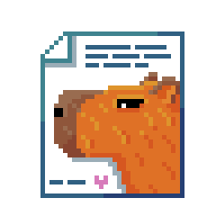

# Copybara



Simple HTML preprocessor for static sites. Made specificaly for a personal website of mine.

#### Table of Contents
* [Quick start](#quick%20start)
  * [Install](#install)
  * [Run](#run)
  * [Use](#use)
* [Options](#options)
  * [Configuration](#configuration)
  * [Command line](#comamndW%20line)

## Quick start

### Install

Copybara runs on [Deno](https://deno.land/).

```bash
# install with deno install
deno install --allow-read --allow-write https://deno.land/x/copybara/copybara.ts
```

### Run

```bash
# run with default arguments
copybara.cmd

# specify input and output
copybara.cmd -i src/template.html -o build/

# display help
copybara.cmd -h
```

### Use

Copybara wraps HTML files with other HTML files. Let's call them _content files_ and _templates_.

The simplest usecase is to provide the same header and footer for every file. The template may look like this:

```html
<!DOCTYPE html>
<html lang="en">
<head>
    <meta charset="UTF-8">
    <meta name="viewport" content="width=device-width, initial-scale=1.0">
    <title><!-- !cb-param title --> - Capybara Fan Club</title>
</head>
<body>
    
    <header>Welcome To The Capybara Lovers Community</header>

    <!-- !cb-wrap subpages -->

    <footer>Made with love</footer>

</body>
</html>
```

In this case we specified a `title` parameter (the word "title" is arbitrary) and the  `subpages` directory for the `cb-wrap` command. 
This directory is where the content files are located. 
There may be any number of them. A sample content file:

```html
<!-- !cb-param title "Fun Facts" -->
<h1>The cultural influence of capybaras</h1>
<h2>Currency</h2>
<p>The image of a capybara can be seen on a 2 Pesos Uruguay coin.</p>
```

This file sets the `title` parameter for itself as _"Fun Facts"_. The command can be placed anywhere in the file.

The file structure looks like this:

```
template.html
subpages/
--- article.html
--- about.html
--- adopt.html
```

If you run the command:

```bash
copybara.cmd -i template.html -o public
```

It will create the `public` directory so that the final structure looks like this:

```
template.html
subpages/
--- article.html
--- about.html
--- adopt.html
public/
--- subpages/
------- article.html
------- about.html
------- adopt.html
```

The generated `public/subpages/article.html` file contains the following:

```html
<!DOCTYPE html>
<html lang="en">
<head>
    <meta charset="UTF-8">
    <meta name="viewport" content="width=device-width, initial-scale=1.0">
    <title>Fun Facts - Capybara Fan Club</title>
</head>
<body>
    
    <header>Welcome To The Capybara Lovers Community</header>

    <!-- !cb-param title "Fun Facts" -->
    <h1>The cultural influence of capybaras</h1>
    <h2>Currency</h2>
    <p>The image of a capybara can be seen on a 2 Pesos Uruguay coin.</p>

    <footer>Made with love</footer>

</body>
</html>
```

The `subpages/article.html` file has been wrapped by `template.html` in place of the `<!-- !cb-wrap subpages -->` command. Also, the `title` parameter declaration has been replaced by the `title` value set in the content file.
The same has happened to all other files inside the `subpages` directory.

## Options

Options for Copybara can be specified either in a configuration file or in a command line. 
Command line options will take presedence over the configuration.
The order is therefore:
- default options
- configuration file options
- command line options

### Configuration

The configuration is stored in an [INI](https://en.wikipedia.org/wiki/INI_file) file. By default, Copybara looks for a `copybara.ini` file. If it doesn't exist, no configuration file is used. Custom file can be used by using the `--config` option.

An example config file:

```ini
inputFile=./main.html
outputPath=./dist
verbose=yes ; in case of flags (boolean options) setting them to any value will set them to 'true'
```

All configuration options have command line counterparts (listed in the table below). 
Because of that no configuration file is needed and all options can be passed via the command line.

### Command line

The following command line options are available. The _INI_ column specifies the configuration file counterparts.

Option | Alias | INI | Default | Description
--- | --- | --- | --- | ---
--config | -c | n/a | ./copybara.ini | The configuration file
--input | -i | inputFile | ./src/template.html | The file to start processing from (the main template)
--out | -o | outputPath | ./out | The folder in which to put the processed files
--verbose | n/a | verbose | n/a | If present, logs more detailed information. Helpful for debugging
--json | -j | produceJson | n/a | If present, saves all content files in a json file. Useful as input for APIs. 
--help | -h | n/a | n/a | Displays the list of commands
--version | -v | n/a | n/a | Displays the used version
